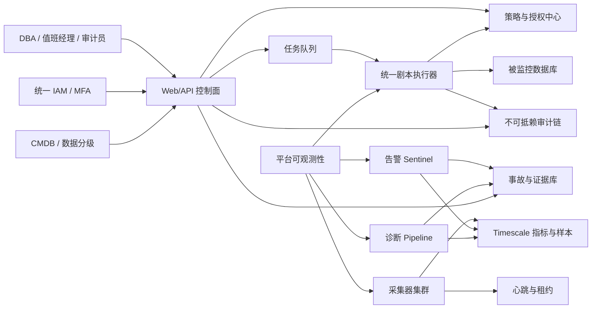
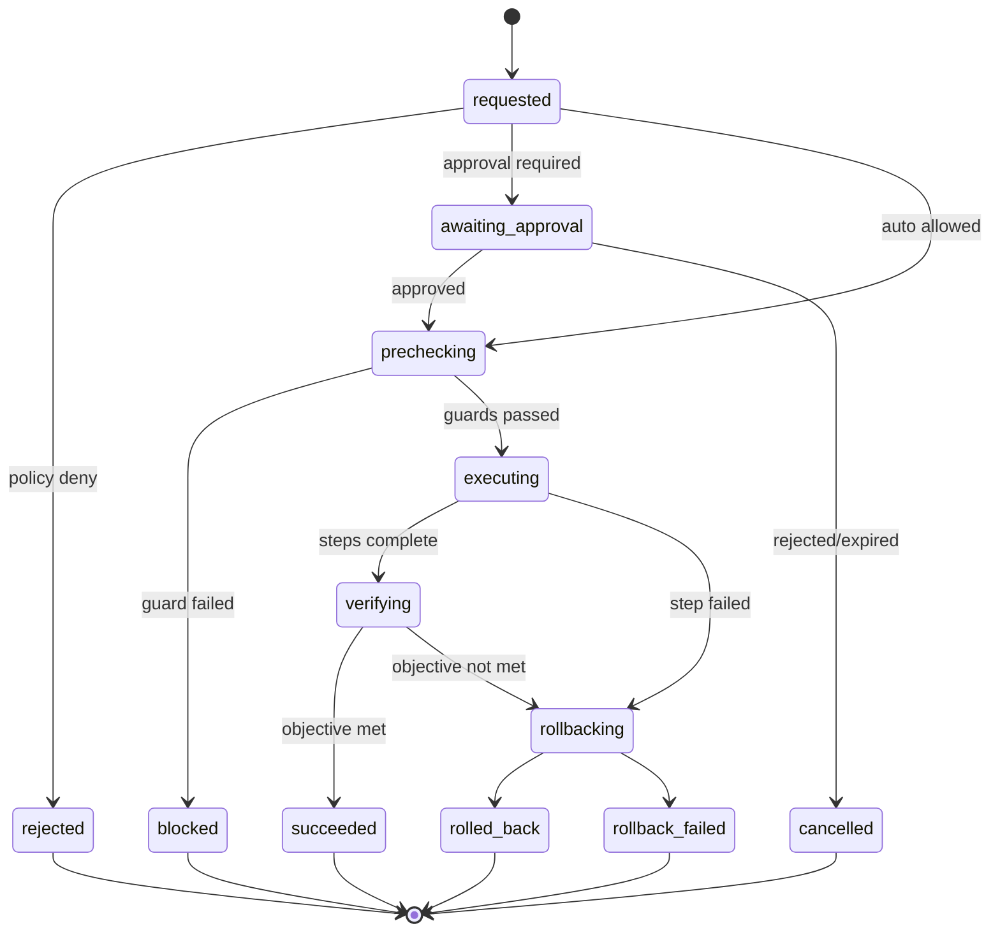

# DB-AIOps v2.5 银行级升级改造详细设计

> 版本：2.5.0  
> 角色视角：银行信息科技 DBA 团队负责人、数据库专家、生产系统责任人  
> 文档级别：概要设计 + 详细设计 + 实施与验收，可作为开发施工依据

## 1. 建设目标

v2.5 的目标不是增加若干页面，而是把平台从“功能演示型 AIOps”升级为**数据可信、动作可控、证据可审、平台自愈、可以承担银行生产值守责任**的数据库运维控制面。

### 1.1 六项硬目标

1. **看得真**：没有采到数据就显示未知/降级，绝不补造正常值、会话或 RCA 证据。
2. **管得住**：实例、组织、环境、敏感等级均参与授权，查询和执行使用同一数据范围。
3. **动得稳**：自治动作必须经过策略、审批、预检、幂等执行、验证、回滚和审计。
4. **扛得住**：500 实例基础容量下，采集、告警、诊断、报告有明确 SLO 和背压。
5. **查得清**：每个结论和动作可还原到采样、规则/模型版本、操作者和目标库响应。
6. **恢复快**：平台自身组件、Timescale、Redis 和目标连接异常时可降级、告警和恢复。

### 1.2 非目标

- v2.5 不允许 LLM 直接生成并执行任意 SQL。
- 不以 AI 建议替代 DBA 最终责任，不承诺跨所有数据库版本的无条件自治。
- 不在本版本自研 CMDB、IAM、工单和短信平台；通过稳定接口集成。

## 2. 总体架构

控制面不直接拼接或执行任意运维 SQL。所有动作由发布过的剧本版本产生；执行器是唯一目标库写入口。采集器、Sentinel、Pipeline 可以多实例部署，但由租约和 fencing token 保证每个分片只有一个有效 leader。

## 3. 领域模型设计

### 3.1 实例与数据分级

在现有 `Database` 上补齐或规范以下概念：

| 字段 | 类型 | 说明 |
|---|---|---|
| `environment` | enum | prod/dr/test/dev |
| `criticality` | enum | core/important/general |
| `data_classification` | enum | L1～L4 |
| `organization_id` | string/FK | 机构/租户边界 |
| `system_code` | string | 归属应用系统 |
| `owner_group` | string | DBA 责任组 |
| `autonomy_ceiling` | enum | 该实例允许的最高自治等级 |
| `maintenance_window` | JSON/FK | 可执行时间窗口 |

模型调整前先出迁移专项设计，清理空环境、重复组织映射和非法等级，再加约束。所有默认值采用最保守策略：生产、核心、只建议、不自动执行。

### 3.2 证据模型

新增统一 `EvidenceRecord`：

| 字段 | 说明 |
|---|---|
| `evidence_id` | UUIDv7/UUID4 主键 |
| `incident_id/database_id` | 所属事故和实例 |
| `kind` | metric/session/sql_plan/log/change/config |
| `source` | collector/query/rule/model/manual |
| `observed_at` | 目标数据发生时间 |
| `collected_at` | 平台采集时间 |
| `payload` | 结构化、脱敏后的证据 |
| `content_hash` | 防篡改摘要 |
| `schema_version` | payload 版本 |
| `retention_class` | 保留策略 |

RCA 节点和边只能引用已有 evidence_id；算法推断必须标 `inference=true` 和算法版本，不能伪装成观测事实。

### 3.3 剧本版本与执行

保留一套权威模型：`Playbook`、`PlaybookVersion`、`PlaybookRun`、`PlaybookStepRun`、`ApprovalRecord`。V2 临时模型只做兼容读取并迁移，禁止产生新的成功记录。

状态机：

任何终态不可覆盖；重试创建新的 attempt 并关联原 run。执行唯一键为 `(database_id, playbook_version_id, idempotency_key)`。

## 4. 权限与安全详细设计

### 4.1 授权决策

授权输入包括 user、role、organization、database、environment、criticality、action、playbook risk、time window、ticket/approval。所有 API 使用同一个 `ScopedDatabaseQuerySet`/policy service，不允许页面各写一套过滤。

决策顺序：

1. 身份有效且 MFA/会话满足要求。
2. 用户对 organization/system/database 有可见范围。
3. 角色允许 action。
4. 实例自治上限不低于动作所需级别。
5. 生产核心库必须有双人复核或紧急流程。
6. 时间窗口、变更单、冻结期满足策略。
7. 受保护账户、系统会话、复制线程等服务端护栏通过。

拒绝统一返回不泄露资源存在性的 404/403，并记录策略命中项。前端隐藏按钮仅改善体验，不构成安全控制。

### 4.2 认证与会话

v2.5 选定 HttpOnly Secure SameSite Cookie + CSRF 的浏览器模式，API 集成使用短期 bearer token。迁移完成前默认关闭 cookie fallback，避免 `csrf_exempt` 接口被 cookie 身份放大为 CSRF。

- 接入银行 IAM/OIDC 时校验 issuer、audience、nonce、时钟偏移和签名轮换。
- 高风险执行要求近 5 分钟内二次认证/MFA。
- 服务账户使用细粒度 scope、IP/证书绑定和短周期轮换。
- token、SQL 字面量、连接串禁止出现在日志和前端错误中。

### 4.3 目标连接与动作护栏

- 采集连接必须 `readonly=True` 且有 statement timeout。
- 执行连接单独凭据、最小权限、短生命周期；不得复用 Web 长连接。
- 参数按剧本 JSON Schema 校验；SQL 值参数化，标识符来自白名单。
- kill/terminate 前重新读取目标会话并比对 `session_id + start_time + user + sql_digest`，防止 SID 重用误杀。
- 默认保护平台自身连接、复制/备份/系统会话、白名单账户及超过影响阈值的动作。

### 4.4 Webhook SSRF

通知目标必须是 HTTPS；解析 DNS 后阻断 loopback、link-local、RFC1918、metadata 地址，重定向后再次校验。官方渠道采用域名白名单；请求设置连接/读取总超时、响应体上限和出站代理。密钥存 Secret Manager，配置只引用 secret id。

## 5. 可信 RCA 设计

### 5.1 处理流水线

1. 冻结事故分析窗口和数据版本。
2. 收集指标、等待、会话、SQL、执行计划、变更和拓扑证据。
3. 规则引擎生成候选原因及可证伪条件。
4. 因果图只用证据节点和显式推断边。
5. LLM 仅负责归纳、解释和补充检查建议，输出受 JSON Schema 约束。
6. 验证器检查引用存在、时间顺序、方言适用性和结论矛盾。
7. 保存算法版本、prompt/model 版本、证据 hash 和置信区间。

### 5.2 置信度

禁止写死 0.85/0.9。候选原因得分由证据覆盖、时间一致性、特异性、反证和数据完整度计算；当关键数据缺失时设置上限。UI 同时展示“置信度”和“证据完整度”，避免高分掩盖少证据。

### 5.3 LLM 安全

- 发送前对账号、IP、库名、SQL 字面量和业务字段脱敏。
- 生产可选择私有模型；外部模型按数据分级禁止或降采样。
- LLM 输出不能直接成为 executable SQL，只能引用已发布剧本。
- 超时、schema 不合法、引用不存在时降级到规则结论并留痕。

## 6. 采集、时序与容量设计

### 6.1 采集架构

实例按一致性 hash 分片；collector 通过租约领取分片，租约包含单调递增 fencing token。写入样本时携带 `(database_id, metric, observed_at, collector_epoch)` 唯一键，消除重复实例造成的重复数据。

每次采集设置：连接总预算、单语句预算、批次 deadline、每实例并发上限和全局背压。高耗指标分低频任务，不与 60 秒核心指标抢占。

### 6.2 Schema 版本

建立 `timeseries_schema_version`，所有 TSDB 变更为幂等迁移并记录 checksum。collector/sentinel/pipeline 启动时声明支持的最小/最大版本；不兼容则 readiness 失败，不带病运行。

### 6.3 数据生命周期

建议默认：原始高频样本 7～30 天、1 分钟聚合 90 天、1 小时聚合 2 年；事故证据和自治审计按银行制度保留。Timescale 启用压缩和 retention policy，删除策略须排除 legal hold。容量告警覆盖磁盘 70/80/90%、chunk 增长、压缩积压和连续聚合延迟。

## 7. 高可用与灾备

| 组件 | HA 方案 | RTO/RPO 建议 |
|---|---|---|
| Web/API | 至少 2 实例，无状态，共享 Redis | RTO <5min，RPO 0 |
| Collector/Sentinel/Pipeline | 多实例 + 租约选主 + fencing | RTO <2 个周期 |
| PostgreSQL 元数据 | 银行标准主备/PITR | RTO <=30min，RPO <=5min |
| Timescale | 流复制/托管 HA + 备份 | RTO <=60min，RPO <=15min |
| Redis | Sentinel/Cluster 或托管服务 | 会话按安全策略；任务不可仅存 Redis |
| 审计归档 | WORM/对象锁 | 制度要求，防删除 |

每半年至少演练元数据恢复、Timescale 恢复、Redis 丢失、机房切换和凭据轮换。演练不是“服务起来”即结束，必须核对事故、审批、审计和指标连续性。

## 8. 可观测性与 SLO

### 8.1 平台自身指标

- 每角色存活、leader、租约剩余、版本、处理水位。
- 采集成功率、延迟、超时、目标库连接耗时、样本落库延迟。
- 告警队列深度、去重率、通知成功率。
- 诊断各阶段耗时、证据缺失率、LLM 降级率。
- 剧本批准/拒绝/失败/回滚率及执行耗时。
- API RED 指标、数据库连接池、TSDB chunk/磁盘和缓存命中。

### 8.2 SLO

| SLI | 目标 |
|---|---|
| 核心实例采集新鲜度 | 月度 99.9% 在 2 个周期内 |
| 告警发现延迟 | P95 <120s |
| WarRoom 可用性 | 月度 99.9% |
| 自治审计完整率 | 100% |
| 越权执行 | 0 |
| 错误成功审计 | 0 |

健康接口拆分 `/livez`、`/readyz`、`/api/v1/system/health`。readiness 的关键依赖失败返回 503；业务降级用结构化字段表达，不能只返回 200 + 文本。

## 9. API 与前端设计

### 9.1 API 规范

- 所有写 API 支持/要求 `Idempotency-Key`，返回 request_id。
- 分页、错误码、时间格式、数据时效、degraded 字段统一。
- GET 无副作用；RCA 刷新、预演、执行均为 POST。
- OpenAPI 描述权限、错误和 schema，契约测试校验前后端。
- V2 兼容端点内部委托 v2.5 service，不再复制业务逻辑；给出废弃日期。

### 9.2 WarRoom

页面只展示服务端返回的真实 target candidates。用户选择后，确认框显示实例、环境、风险、会话指纹、影响范围、审批要求和回滚方案；禁止硬编码 session/user。

RCA 图中观测事实、算法推断、LLM 解释使用不同视觉编码；每个节点可展开原始证据、采样时间和数据缺失说明。

### 9.3 前端工程

统一 API client，具备 30 秒上限、request_id、401 处理、仅幂等请求的有限重试、错误归一化。路由和 ECharts 按需加载；设置 gzip JS 预算。HTML 报告继续经 DOMPurify，并为 XSS payload 建测试。

## 10. 部署与配置设计

### 10.1 容器

- Python 使用受支持的小版本并固定镜像摘要；非 root、只读根文件系统、最小 capability。
- 前端多阶段构建，生产由 Nginx/等效服务器提供静态文件，不运行 Vite/npm install。
- web、collector、sentinel、pipeline 分独立 service/image command，配置健康探针和优雅停止。
- 数据库/Redis/ES 仅内部网络；外部访问经堡垒机或受控端口。

### 10.2 配置契约

`DJANGO_ENV` 规范值为 development/test/production；旧值仅兼容一个版本并告警。所有配置进入 `monitor/appconf.py` SPECS 或启动必需环境校验，标注类型、默认值、敏感性、可热更新性和适用环境。

production 启动检查：SECRET_KEY、加密密钥、数据库、Redis、allowed hosts、CSRF origins、TSDB schema、角色配置、DEBUG、安全 Cookie。任一硬条件失败则退出，不能静默降级。

## 11. CI/CD 与质量门禁

流水线顺序：

1. 锁文件一致性和 secret/redline 扫描全仓基线。
2. Python compile + Ruff 高风险规则 + migrations check。
3. Unit + coverage 增量门槛。
4. Integration：PostgreSQL/Timescale/Redis。
5. MySQL/PG/Oracle 方言矩阵；商业库夜间环境。
6. 前端 lint/test/build/bundle budget。
7. Bandit、pip-audit、npm audit、SBOM、镜像扫描。
8. 部署临时环境执行 smoke/SIT 和 schema 检查。

本仓库直推 master，因此本地 `scripts/validate.sh all` 是提交前强制闸门，CI 是推后告警。长期应迁移到受保护分支和双人复核；在组织策略不允许前，建立推送后自动回滚或值班响应制度。

## 12. 实施工作包

### WP0：基线止血（1～2 天）

- 修复诊断 `plans` 保存、TSDB cursor、schema 漂移、F821、重复键。
- 关闭外部测试调用，7 条 expectedFailure 转普通回归。
- 验收：unit/backend、Phase 6/8、静态确定性错误通过。

### WP1：执行面统一（3～5 天）

- V2 数据范围统一；阻塞图改真实数据。
- V2 剧本映射旧权威执行器，补幂等、状态机和服务端会话护栏。
- RCA GET 改无副作用，原子保存证据图。
- 验收：UAT-03/05/06/07/08/09。

### WP2：生产与供应链（2～4 天）

- 环境 fail-fast、密钥、Redis/TSDB 配置统一。
- 依赖升级锁定；容器多阶段、内部网络、安全探针。
- CI 安全门禁、全仓红线、SBOM。
- 验收：新主机从空卷启动，安全审计无高危。

### WP3：可信诊断与证据（5～8 天）

- EvidenceRecord、证据化 RCA、数据完整度、LLM 脱敏与降级。
- WarRoom 展示证据来源和推断性质。
- 验收：同一冻结数据可重复生成一致结论；无数据不造结论。

### WP4：HA、容量与自监控（5～8 天）

- 租约/fencing、幂等采集、角色心跳、readiness。
- 时序保留压缩、容量告警、性能基准和长稳。
- 验收：杀 leader 后 2 个周期恢复；无重复动作/告警。

### WP5：银行集成与投产（依赖外部环境）

- IAM/MFA、CMDB、工单、通知、WORM 审计、灾备。
- 完成达梦/GBase/TDSQL 版本矩阵和 12 条 UAT 签字。
- 完成等保/行内安全评审、备份恢复和应急演练。

## 13. 数据迁移与回退

1. 先发布兼容读代码和新表，旧端点仍可用。
2. 后台迁移 V2 模板/运行记录：模拟成功记录标记 `legacy_unverified=true`，不得伪装成已验证执行。
3. 双写仅用于可校验的元数据，审计链不做破坏性回写。
4. 切换 V2 API 到统一 service，观察一个发布窗口。
5. 停止旧模型写入，保留只读查询至制度保留期。

数据库迁移均可向前兼容；应用回退不能删除新表/列。涉及约束时先清理存量脏数据并保存审计清单。TSDB 迁移在低峰分批执行，先加 nullable 列/回填，再切读写，最后加约束。

## 14. 验收与投产门槛

### 14.1 技术验收

- P0/P1 关闭；所有已知 expectedFailure 转为通过。
- 后端、前端、方言、Phase 5～8、12 条 UAT 全通过。
- API 50 并发 15 分钟 p95 <500ms；500 实例采集周期达标。
- 外部依赖关闭时所有 unit 可离线、稳定、可重复。
- 高危依赖漏洞为零，F821/静默异常/越权反测满足门槛。

### 14.2 生产验收

- 生产参数、密钥、网络、账号权限经双人核对。
- 备份可恢复，leader 故障、TSDB/Redis 故障、通知故障完成演练。
- DBA、应用、信息安全、审计、运维平台五方完成 UAT/风险签字。
- 回退脚本、观察指标、值班表、重大故障通讯录齐备。

## 15. v2.5 完成定义

只有在“真实数据、统一授权、真实执行、完整审计、故障可恢复、测试可重复”六项同时满足时，版本才能标记为 v2.5 正式版。页面可见功能完成但证据链、权限或运行保障未完成，只能标记为技术预览，不得进入银行生产核心环境。

