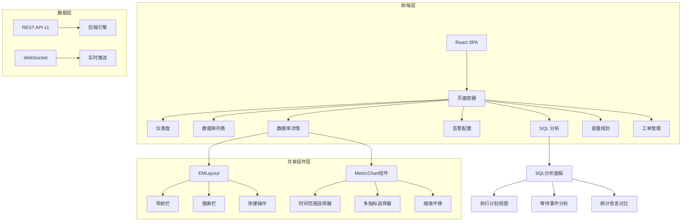

# DB-AIOps 前端 UX 优化方案
## 版本：v1.0
## 日期：2025年
## 状态：草稿

---

## 一、项目背景与目标

### 1.1 当前问题

通过代码检视，发现当前系统在前端用户体验方面存在以下核心问题：

| 问题 | 现状 | 影响 |
|------|------|------|
| 监控指标展示不清晰 | 指标分类混乱，重要指标与次要指标混杂 | 用户难以快速定位问题 |
| 告警配置不灵活 | 仅支持单模板，无法应对不同场景 | 新库接入效率低 |
| 下钻能力弱 | 缺少历史趋势分析和多时间段对比 | 问题根因难以追溯 |
| SQL 分析不直观 | 慢查询仅以列表形式展示 | 缺乏可视化分析和上下文关联 |
| 与 Oracle EM 风格差距大 | 当前 UI 偏向简单仪表盘 | 用户学习成本高 |

### 1.2 用户期望

- 参考 Oracle Enterprise Manager Cloud Control 13c 13.2 的用户体验
- 告警配置支持多模板 + 单库单指标覆盖
- 历史曲线支持预设 + 自定义时间段
- SQL 分析具备与 EMCC 相近的诊断能力

### 1.3 优化目标

1. **指标展示重构**：分类清晰、层次分明、关键指标突出
2. **告警配置多模板化**：类型多模板 → 库选模板 → 单指标覆盖
3. **历史曲线增强**：预设时间段 + 自定义 + 多指标对比
4. **SQL 分析重构**：向 Oracle EMCC 看齐，提供 SQL 执行计划分析和上下文诊断
5. **整体 UI 风格升级**：借鉴 EMCC 的专业监控界面设计

---

## 二、高层设计

### 2.1 整体架构



### 2.2 Oracle EMCC 13c 关键特性对标

| EMCC 功能 | 本系统当前状态 | 优化方案 |
|-----------|---------------|----------|
| Home 主页 | 简单统计卡片 | 仿 EMCC 主页布局：Top Alerts + DB Fleet Summary + Performance Summary |
| Target Navigation | 导航树 | 左侧 DB Type 分类导航树 |
| Performance Hub | 无 | 新增 Performance Hub 页面，类似 EMCC 的 ADDM/ASH 分析 |
| SQL Monitoring | 无 | 新增 SQL Monitoring 页面，展示 SQL 执行详情、执行计划、等待事件 |
| Alert Configuration | 简单表单 | 多模板 + 覆盖配置界面 |
| Historical Charts | 简单折线图 | 增强：多指标对比、时间段对比、统计叠加 |

### 2.3 技术选型

| 模块 | 当前技术 | 优化方案 | 理由 |
|------|----------|----------|------|
| 图表库 | Recharts | 升级到 ECharts | ECharts 性能更好，支持更多交互（缩放、框选、数据区域缩放） |
| 表格 | Ant Design Table | 保持 + 增强 | Ant Design Table 功能完善，扩展虚拟滚动 |
| 布局 | CSS Grid | EMCC 风格布局 | 左侧导航 + 顶部工具栏 + 主内容区 |
| 状态管理 | React Hooks | 引入 Zustand | 轻量级，适合复杂状态管理 |
| 图表交互 | Recharts 内置 | ECharts + 自定义扩展 | 支持 dataZoom、legend 拖拽等高级交互 |

---

## 三、详细设计

### 3.1 仪表盘重构（仿 EMCC Home 风格）

#### 3.1.1 页面布局

```
┌─────────────────────────────────────────────────────────────────┐
│ 🔍 全局搜索栏                    🔔 通知  👤 用户   ⚙️ 设置     │
├────────┬────────────────────────────────────────────────────────┤
│        │  📊 总体健康状况                              [刷新]   │
│  📁    │  ┌────────┐ ┌────────┐ ┌────────┐ ┌────────┐          │
│  Oracle│  │   A    │ │   B    │ │   C    │ │   D    │          │
│  ├ PRD │  │  85%   │ │  92%   │ │  78%   │ │  65%   │          │
│  └ DEV │  └────────┘ └────────┘ └────────┘ └────────┘          │
│        │                                                        │
│  MySQL │  🚨 Top Alerts (最近 24 小时)                           │
│  ├ 库1 │  ┌────────────────────────────────────────────────┐   │
│  └ 库2 │  │ ⚠️  Oracle PRD: 连接使用率 > 85% (临界)        │   │
│        │  │ 🔴 MySQL 库1: 表空间使用率 > 90% (严重)         │   │
│ Postgre│  │ ⚠️  PG DEV: 慢查询数量突增                       │   │
│        │  └────────────────────────────────────────────────┘   │
│  达梦  │                                                        │
│        │  📈 Performance Summary (最近 1 小时)                  │
│        │  ┌──────────────────┐ ┌──────────────────┐          │
│        │  │  平均 QPS 趋势    │ │  平均响应时间     │          │
│        │  └──────────────────┘ └──────────────────┘          │
│        │                                                        │
│        │  🗄️ Database Fleet Summary                             │
│        │  ┌────────────────────────────────────────────────┐   │
│        │  │ DB Name │ Type │ Status │ Health │ Alerts │ QPS│   │
│        │  ├─────────┼──────┼────────┼────────┼────────┼────┤   │
│        │  │ Oracle  │ ORA  │   🟢   │   A    │   2    │ 1K │   │
│        │  │ MySQL   │ MY   │   🟡   │   B    │   5    │ 500│   │
│        │  └────────────────────────────────────────────────┘   │
└────────┴────────────────────────────────────────────────────────┘
```

#### 3.1.2 核心组件设计

1. **左侧导航树**（`TargetNavigationTree`）
   - 按数据库类型分组（Oracle/MySQL/PostgreSQL/达梦/GBase/TDSQL）
   - 每组下按业务系统或自定义分组
   - 支持折叠/展开
   - 节点状态图标（🟢正常 🟡警告 🔴严重 ⚫离线）
   - 右键菜单：查看详情、配置告警、跳转 Performance Hub

2. **Top Alerts 面板**（`TopAlertsPanel`）
   - 按严重级别分组（Critical/Error/Warning）
   - 每条告警显示：数据库名、告警消息、触发时间、持续时长
   - 点击跳转至数据库详情页并定位到相关指标
   - 支持一键确认

3. **Performance Summary**（`PerformanceSummaryCharts`）
   - 聚合视图：所有数据库的 QPS/响应时间/TPS 平均值趋势
   - 可下钻至单库

4. **Database Fleet Table**（`DatabaseFleetTable`）
   - 紧凑表格，一目了然
   - 列：DB Name, Type, Status, Health Grade, Active Alerts, QPS, Conn Usage
   - 排序、过滤、搜索
   - 点击行跳转至数据库详情

#### 3.1.3 EMCC Home 风格关键元素

| 元素 | EMCC 风格 | 实现方案 |
|------|-----------|----------|
| 配色 | 深蓝主色调，专业沉稳 | #1a3a5c 深蓝 + #e8f0f8 浅蓝背景 |
| 字体 | 清晰层次，标题突出 | 分级标题：24px/18px/14px |
| 图标 | 状态图标明确 | 🟢🟡🔴⚫ + 文字标签 |
| 卡片 | 白底卡片 + 轻阴影 | border-radius: 4px, box-shadow: 0 2px 8px rgba(0,0,0,0.08) |
| 表格 | 高密度数据表 | 紧凑行高，斑马纹 |

---

### 3.2 告警配置多模板化

#### 3.2.1 三层配置模型

```
                    ┌─────────────────┐
                    │  AlertTemplate   │  ← 第一层：类型模板
                    │  (DB Type Level) │
                    └────────┬────────┘
                             │
              ┌──────────────┼──────────────┐
              │              │              │
              ▼              ▼              ▼
        ┌───────────┐  ┌───────────┐  ┌───────────┐
        │ TemplateA │  │ TemplateB │  │ TemplateC │
        │ (生产库)  │  │ (测试库)  │  │ (分析库)  │
        └─────┬─────┘  └─────┬─────┘  └─────┬─────┘
              │              │              │
              │         ┌────┴────┐         │
              │         │ Database│         │
              │         │ Config  │         │
              │         │ (选模板)│         │
              │         └────┬────┘         │
              │              │              │
              └──────────────┼──────────────┘
                             │
                    ┌────────┴────────┐
                    │ DatabaseAlert   │  ← 第三层：单指标覆盖
                    │ Override        │
                    │ (可选覆盖)      │
                    └────────────────┘
```

#### 3.2.2 数据库接入流程优化

当新增纳管数据库时：

```
步骤 1: 填写基本信息
        ├── DB Name: ____________
        ├── DB Type: [Oracle ▼]
        └── Host/Port/Service: ____________

步骤 2: 选择告警模板
        ├── 🔘 不使用模板（全部手动配置）
        ├── 🔘 使用现有模板：
        │       ├── ○ Template A (生产库-严格) [推荐]
        │       ├── ○ Template B (测试库-宽松)
        │       └── ○ Template C (分析库-监控容量)
        └── 🔘 创建新模板

步骤 3: 自定义覆盖（可选）
        ├── [+ 添加覆盖规则]
        │       ├── 指标: [conn_usage_pct ▼]
        │       ├── 覆盖值: Warning: [80] Error: [90] Critical: [95]
        │       └── 备注: 生产库对连接数更敏感
        └── [完成]
```

#### 3.2.3 告警配置页面设计

**Tab 1: 模板管理**

| 模板名称 | 数据库类型 | 关联库数 | 覆盖数 | 操作 |
|----------|------------|----------|--------|------|
| 生产库-严格 | Oracle | 5 | 12 | [编辑] [复制] [删除] |
| 测试库-宽松 | MySQL | 3 | 0 | [编辑] [复制] [删除] |

- 新增模板：填写模板名称 → 选择 DB 类型 → 配置告警规则
- 支持从现有模板复制创建
- 关联库数统计：该模板当前有多少数据库在使用

**Tab 2: 告警规则配置**

左侧：模板树（模板 → 规则列表）
右侧：规则详情编辑面板

```
模板: 生产库-严格 (Oracle)
├── 📁 连接类
│   ├── conn_usage_pct [已配置]
│   ├── active_connections [未配置]
│   └── max_connections [未配置]
├── 📁 性能类
│   ├── buffer_hit_ratio [已配置]
│   └── qps [未配置]
├── 📁 存储类
│   ├── tablespace_used_pct [已配置]
│   └── datafile_count [未配置]
└── 📁 复制类
    ├── replication_lag [已配置]
    └── slave_io_running [已配置]
```

选中 `conn_usage_pct` 后右侧显示：

```
┌──────────────────────────────────────────────────────────────┐
│  指标: conn_usage_pct (连接使用率)                            │
│  描述: 当前连接数 / 最大连接数 × 100%                         │
│  单位: %                                                      │
├──────────────────────────────────────────────────────────────┤
│  规则类型: [固定阈值 ▼]   方向: [上升触发 ▼]                 │
│                                                              │
│  三级阈值:                                                   │
│  ┌──────────┐  ┌──────────┐  ┌──────────┐                   │
│  │ Warning  │  │  Error   │  │ Critical │                   │
│  │   >70    │  │   >85    │  │   >95    │                   │
│  └──────────┘  └──────────┘  └──────────┘                   │
│                                                              │
│  基线振幅 (替代方案):                                         │
│  ┌──────────┐  ┌──────────┐  ┌──────────┐                   │
│  │ Warning  │  │  Error   │  │ Critical │                   │
│  │  >30%    │  │  >50%    │  │  >70%    │                   │
│  └──────────┘  └──────────┘  └──────────┘                   │
│                                                              │
│  持续性检测: [3] 次连续触发才告警 (范围: 1-10)              │
│  [✓] 启用此规则    [保存] [取消]                             │
└──────────────────────────────────────────────────────────────┘
```

**Tab 3: 数据库覆盖配置**

展示每个数据库的覆盖情况：

| 数据库 | 当前模板 | 覆盖数 | 状态 | 操作 |
|--------|----------|--------|------|------|
| Oracle PRD | 生产库-严格 | 3 | ✅ 3个规则生效 | [查看] [编辑] |
| Oracle DEV | 测试库-宽松 | 0 | ⚙️ 使用模板 | [升级为覆盖] |
| MySQL 库1 | 生产库-严格 | 5 | ⚠️ 2个即将到期 | [查看] |

---

### 3.3 历史曲线增强

#### 3.3.1 时间范围选择器

支持三种模式：

1. **预设时间段**
   - 最近 15 分钟 / 1 小时 / 6 小时 / 24 小时 / 7 天 / 30 天 / 90 天
   - 与 EMCC 一致的时间粒度选项

2. **自定义时间段**
   - 开始时间选择器（精确到分钟）
   - 结束时间选择器（精确到分钟）
   - 日期范围选择器

3. **对比模式**
   - 与上一个同期对比（如：本小时 vs 上小时，昨天 vs 今天）
   - 支持多时间段叠加显示

#### 3.3.2 指标选择器

```
┌──────────────────────────────────────────────────────────────┐
│  指标选择                                               [x]  │
├──────────────────────────────────────────────────────────────┤
│  🔍 搜索: [____]                                            │
│                                                              │
│  分类:                                                       │
│  ├─ 📁 连接类 (3)                                           │
│  │     ├─ [✓] conn_usage_pct (连接使用率)                   │
│  │     ├─ [ ] active_connections (活跃会话)                 │
│  │     └─ [ ] max_connections (最大连接)                    │
│  ├─ 📁 性能类 (5)                                           │
│  │     ├─ [ ] qps (每秒查询数)                              │
│  │     ├─ [ ] tps (每秒事务数)                              │
│  │     └─ ...                                               │
│  └─ 📁 存储类 (2)                                           │
│        ├─ [ ] tablespace_used_pct (表空间使用率)            │
│        └─ ...                                               │
│                                                              │
│  已选择 (3):                                                 │
│  ┌──────┐ ┌──────┐ ┌──────┐                               │
│  │conn_%│ │  qps │ │tps   │ [清除]                         │
│  └──────┘ └──────┘ └──────┘                               │
│                                                              │
│  [确定]  [取消]                                              │
└──────────────────────────────────────────────────────────────┘
```

#### 3.3.3 ECharts 增强图表

关键交互特性：

| 功能 | 描述 | EMCC 对标 |
|------|------|-----------|
| 框选缩放 | 鼠标框选区域放大 | 类似 EMCC 的 Zoom In |
| 数据区域缩放 | 底部滑块控制显示范围 | 类似 EMCC 的 View Port |
| 十字光标 | 悬停显示所有指标值 | 类似 EMCC 的 Target Hover |
| 图例拖拽 | 拖拽图例排序或隐藏 | 类似 EMCC 的 Legend |
| 统计叠加 | 显示均值/最大/最小/标准差阴影 | 类似 EMCC 的 Baseline |
| 多 Y 轴 | 不同量级的指标使用独立 Y 轴 | 类似 EMCC 的 Multi-Metric |

```javascript
// ECharts 配置示例
option = {
  dataZoom: [
    { type: 'slider', start: 0, end: 100 },  // 底部滑块
    { type: 'inside', start: 0, end: 100 }   // 鼠标滚轮缩放
  ],
  tooltip: {
    trigger: 'axis',
    formatter: function(params) {
      // 显示所有指标的十字光标值
    }
  },
  legend: {
    selected: { /* 可拖拽排序 */ }
  },
  series: [
    {
      name: '连接使用率',
      type: 'line',
      yAxisIndex: 0,  // 左侧 Y 轴
      markLine: {
        silent: true,
        data: [
          { type: 'average', name: '均值' },
          { type: 'max', name: '最大值' }
        ]
      }
    },
    {
      name: 'QPS',
      type: 'line',
      yAxisIndex: 1,  // 右侧 Y 轴
    }
  ]
};
```

#### 3.3.4 指标分析面板

点击图表中的异常点，弹出分析面板：

```
┌──────────────────────────────────────────────────────────────┐
│  异常分析                                                    │
├──────────────────────────────────────────────────────────────┤
│  📊 指标: conn_usage_pct                                     │
│  ⏰ 时间: 2024-01-15 14:30:00                               │
│  📈 当前值: 87.5%                                            │
│  📉 基线均值: 65.2% (偏差: +34.2%)                          │
│  📉 基线标准差: 8.3%                                         │
│                                                              │
│  🔍 关联分析:                                                │
│  ├─ 同一时间段内:                                            │
│  │     • active_sessions: +45% (异常)                       │
│  │     • qps: -12% (下降)                                   │
│  │     • buffer_hit_ratio: -5% (轻微下降)                   │
│  └─ 可能的根因:                                              │
│        ⚠️ 检测到 3 个长查询，可能导致会话堆积                 │
│                                                              │
│  💡 建议操作:                                                │
│  1. 查看 Performance Hub 的 ASH 分析                         │
│  2. 检查 Top SQL 是否有新出现的慢查询                         │
│  3. 查看会话列表是否有阻塞                                   │
│                                                              │
│  [跳转 Performance Hub] [查看会话] [查看 Top SQL]           │
└──────────────────────────────────────────────────────────────┘
```

---

### 3.4 SQL 分析重构（对标 Oracle EMCC）

#### 3.4.1 参考 Oracle EMCC SQL Monitoring

EMCC SQL Monitoring 核心功能：

| 功能 | 描述 |
|------|------|
| SQL 列表 | 显示正在执行和最近执行的 SQL |
| 执行计划 | 可视化执行计划树状图 |
| 执行统计 | 行数、内存使用、IO、时间分解 |
| 等待事件 | 每个执行步骤的等待事件分析 |
| 并行执行 | 并行度、并行进程状态 |
| 历史趋势 | SQL 执行历史、性能对比 |

#### 3.4.2 新增 SQL Monitoring 页面

入口：`数据库详情 → Performance Hub → SQL Monitoring`

```
┌──────────────────────────────────────────────────────────────────────────┐
│  SQL Monitoring                                              [刷新] [导出]│
├──────────────────────────────────────────────────────────────────────────┤
│  时间范围: [最近 1 小时 ▼]    状态: [全部 ▼]    搜索: [__________]       │
├──────────────────────────────────────────────────────────────────────────┤
│                                                                          │
│  SQL ID    │ SQL Text                │ 状态        │ 耗时    │ 解析数   │
│  ──────────┼─────────────────────────┼─────────────┼─────────┼─────────│
│  abc123    │ SELECT * FROM orders... │ 🔴 正在执行 │ 45s     │ 1.2M    │
│  def456    │ UPDATE employees SET... │ 🟡 正在执行 │ 12s     │ 500K    │
│  ghi789    │ SELECT COUNT(*) FROM... │ 🟢 完成     │ 2.3s    │ 800K    │
│                                                                          │
└──────────────────────────────────────────────────────────────────────────┘
```

点击某条 SQL，进入详情页：

```
┌──────────────────────────────────────────────────────────────────────────┐
│  SQL 详情                                        [执行计划] [ASH分析] [关闭]│
├──────────────────────────────────────────────────────────────────────────┤
│  SQL ID: abc123                                                        │
│  SQL Text: SELECT o.*, c.name FROM orders o JOIN customers c ...         │
├──────────────────────────────────────────────────────────────────────────┤
│                                                                          │
│  ┌────────────────────────────────────────────────────────────────────┐ │
│  │                         执行计划可视化                                │ │
│  │                                                                     │ │
│  │     ┌───────────────┐                                               │ │
│  │     │  SELECT       │ ← Cost: 1234                                  │ │
│  │     └───────┬───────┘                                               │ │
│  │             │                                                        │ │
│  │     ┌───────┴───────┐                                               │ │
│  │     │   HASH JOIN   │ ← Cost: 1000  Rows: 50K                      │ │
│  │     └───────┬───────┘                                               │ │
│  │       ┌────┴────┐                                                    │ │
│  │       │         │                                                    │ │
│  │  ┌────┴───┐ ┌───┴────┐                                               │ │
│  │  │ TABLE  │ │ TABLE  │                                              │ │
│  │  │ ORDERS │ │CUSTOMER│                                              │ │
│  │  │ FULL   │ │ INDEX  │                                              │ │
│  │  │Scan 1M │ │ RANGE  │                                              │ │
│  │  └────────┘ └────────┘                                              │ │
│  └────────────────────────────────────────────────────────────────────┘ │
│                                                                          │
│  ┌────────────────────────────────────────────────────────────────────┐ │
│  │  执行统计                                                            │ │
│  │  ─────────────────────────────────────────────────────────────────  │ │
│  │  总耗时: 45.2s                                                       │ │
│  │  CPU 时间: 12.3s    │  IO 时间: 28.5s    │  等待时间: 4.4s          │ │
│  │  解析次数: 1        │  执行次数: 1        │  提取行数: 50K           │ │
│  │  共享内存: 2.3MB    │  排序内存: 512KB    │  临时空间: 0             │ │
│  └────────────────────────────────────────────────────────────────────┘ │
│                                                                          │
│  ┌────────────────────────────────────────────────────────────────────┐ │
│  │  等待事件分解                                                        │ │
│  │  ─────────────────────────────────────────────────────────────────  │ │
│  │  db file sequential read  ████████████████████░░░░░  55% (2.4s)     │ │
│  │  log file sync            █████░░░░░░░░░░░░░░░░░░░░  15% (0.7s)     │ │
│  │  buffer busy waits       ███░░░░░░░░░░░░░░░░░░░░░░  10% (0.4s)     │ │
│  └────────────────────────────────────────────────────────────────────┘ │
│                                                                          │
│  [查看完整执行计划] [导出 AWR 报告] [生成优化建议]                         │
└──────────────────────────────────────────────────────────────────────────┘
```

#### 3.4.3 后端数据结构扩展

```python
# 新增 SQL 执行记录模型
class SQLExecutionRecord(models.Model):
    sql_id = models.CharField(max_length=64, unique=True)
    sql_text = models.TextField()
    db_config = models.ForeignKey('DatabaseConfig', on_delete=models.CASCADE)
    status = models.CharField(choices=[
        ('RUNNING', '正在执行'),
        ('COMPLETED', '已完成'),
        ('ERROR', '执行失败'),
    ])
    start_time = models.DateTimeField()
    end_time = models.DateTimeField(null=True)
    elapsed_seconds = models.FloatField(default=0)
    cpu_time = models.FloatField(default=0)
    io_time = models.FloatField(default=0)
    wait_time = models.FloatField(default=0)
    rows_processed = models.BigIntegerField(default=0)
    execution_plan = models.JSONField(default=dict)  # 执行计划 JSON
    wait_events = models.JSONField(default=list)  # 等待事件列表
    bind_variables = models.JSONField(default=dict)
```

#### 3.4.4 慢查询分析增强

当前问题：慢查询仅以列表展示

优化方案：参考 EMCC 的 ADDM 分析

| 当前状态 | 优化后 |
|----------|--------|
| 简单列表 | 分组 + 分类（Top Impact / Top Duration / Top Frequency） |
| 无上下文 | 关联指标（同一时间段的活动会话、等待事件） |
| 无优化建议 | 自动生成索引建议、执行计划分析 |
| 无对比 | 与历史慢查询对比（性能趋势） |

---

### 3.5 数据库详情页重构

#### 3.5.1 页面布局（仿 EMCC Target Details）

```
┌──────────────────────────────────────────────────────────────────────────┐
│  ← 返回  Oracle PRD - 核心交易库                        [🔄刷新] [⚙️配置]│
├──────────────────────────────────────────────────────────────────────────┤
│                                                                          │
│  ┌────────┐ ┌────────┐ ┌────────┐ ┌────────┐ ┌────────┐ ┌────────┐    │
│  │  状态  │ │  健康度 │ │  QPS   │ │  TPS   │ │ 连接数  │ │表空间  │    │
│  │  🟢 正常│ │   A     │ │  1,234 │ │   567  │ │  245   │ │  72%   │    │
│  └────────┘ └────────┘ └────────┘ └────────┘ └────────┘ └────────┘    │
│                                                                          │
├──────────────────────────────────────────────────────────────────────────┤
│  [概览] [性能] [可用性] [资源] [变更] [管理]                              │
├──────────────────────────────────────────────────────────────────────────┤
│                                                                          │
│  ▼ Performance Hub                                                      │
│  ┌──────────────────────────────────────────────────────────────────┐   │
│  │                                                                   │   │
│  │  时间范围: [最近 1 小时 ▼]  [+自定义]  [📊 对比模式]              │   │
│  │                                                                   │   │
│  │  ┌──────────────────────────────────────────────────────────────┐ │   │
│  │  │                     QPS / TPS 趋势图                        │ │   │
│  │  │  [缩放] [平移] [框选] [导出]                                 │ │   │
│  │  └──────────────────────────────────────────────────────────────┘ │   │
│  │                                                                   │   │
│  │  ┌──────────────────────────────────────────────────────────────┐ │   │
│  │  │                     响应时间趋势图                          │ │   │
│  │  └──────────────────────────────────────────────────────────────┘ │   │
│  │                                                                   │   │
│  └──────────────────────────────────────────────────────────────────┘   │
│                                                                          │
│  ▼ Top Activity                                                         │
│  ┌──────────────────────────────────────────────────────────────────┐   │
│  │  [ASH 分析] [SQL Monitoring] [等待事件] [会话]                    │   │
│  │                                                                   │   │
│  │  ┌──────────────────────────────────────────────────────────────┐ │   │
│  │  │  活动会话实时列表                                             │ │   │
│  │  │  SID │ 用户 │ 程序 │ 状态 │ 等待事件 │ SQL ID   │ 耗时      │ │   │
│  │  │  145 │ SCOTT│ SQL* │ ACTIVE│ db file │ abc123   │ 45s      │ │   │
│  │  └──────────────────────────────────────────────────────────────┘ │   │
│  └──────────────────────────────────────────────────────────────────┘   │
│                                                                          │
└──────────────────────────────────────────────────────────────────────────┘
```

#### 3.5.2 Performance Hub 核心特性

| 特性 | 描述 |
|------|------|
| 多维度趋势图 | QPS/TPS/响应时间/连接数/表空间等可叠加显示 |
| 实时 ASH 分析 | 最近活动会话采样，Top SQL、Top Wait Event |
| SQL Monitoring 入口 | 跳转至 SQL 详细监控页面 |
| ADDM 摘要 | 自动数据库诊断（当检测到性能问题时） |
| AWR 对比 | 可选时间段与基线对比 |

---

## 四、数据模型变更

### 4.1 新增模型

```python
# monitor/models.py 新增

class AlertTemplate(models.Model):
    """告警模板 - 支持同一数据库类型多个模板"""
    name = models.CharField(max_length=100)
    db_type = models.CharField(max_length=20)  # oracle/mysql/pgsql/dm/gbase/tdsql
    description = models.TextField(blank=True)
    is_default = models.BooleanField(default=False)  # 是否为该类型的默认模板
    created_at = models.DateTimeField(auto_now_add=True)
    updated_at = models.DateTimeField(auto_now=True)
    
    class Meta:
        unique_together = ['name', 'db_type']

class SQLExecutionRecord(models.Model):
    """SQL 执行记录"""
    sql_id = models.CharField(max_length=64, unique=True)
    sql_text = models.TextField()
    db_config = models.ForeignKey('DatabaseConfig', on_delete=models.CASCADE)
    status = models.CharField(max_length=20)
    start_time = models.DateTimeField()
    end_time = models.DateTimeField(null=True)
    elapsed_seconds = models.FloatField(default=0)
    cpu_time = models.FloatField(default=0)
    io_time = models.FloatField(default=0)
    wait_time = models.FloatField(default=0)
    rows_processed = models.BigIntegerField(default=0)
    execution_plan = models.JSONField(default=dict)
    wait_events = models.JSONField(default=list)
    
class MetricAlertRule(models.Model):
    """单指标告警规则 - 模板的细化"""
    template = models.ForeignKey('AlertTemplate', on_delete=models.CASCADE)
    metric_key = models.CharField(max_length=100)
    rule_type = models.CharField(choices=[
        ('threshold', '固定阈值'),
        ('baseline_amplitude', '基线振幅'),
    ])
    direction = models.CharField(choices=[
        ('up', '上升触发'),
        ('down', '下降触发'),
        ('both', '双向触发'),
    ])
    warn_threshold = models.FloatField(null=True)
    error_threshold = models.FloatField(null=True)
    critical_threshold = models.FloatField(null=True)
    warn_amplitude_pct = models.FloatField(null=True)
    error_amplitude_pct = models.FloatField(null=True)
    critical_amplitude_pct = models.FloatField(null=True)
    persistence_count = models.IntegerField(default=3)  # 持续多少次
    is_enabled = models.BooleanField(default=True)
    
    class Meta:
        unique_together = ['template', 'metric_key']
```

### 4.2 模型变更

```python
# DatabaseConfig 新增字段
class DatabaseConfig(models.Model):
    # ... 现有字段 ...
    
    # 新增字段
    alert_template = models.ForeignKey(
        'AlertTemplate', 
        on_delete=models.SET_NULL,
        null=True,
        blank=True,
        help_text='关联的告警模板'
    )
    service_type = models.CharField(
        max_length=50,
        blank=True,
        help_text='业务类型：生产/测试/开发/分析'
    )
    business_group = models.CharField(
        max_length=100,
        blank=True,
        help_text='业务分组'
    )
```

---

## 五、API 变更

### 5.1 新增 API 端点

| 端点 | 方法 | 描述 |
|------|------|------|
| `/api/v1/alert-templates/` | GET/POST | 模板列表/创建 |
| `/api/v1/alert-templates/<id>/` | GET/PUT/DELETE | 模板详情/更新/删除 |
| `/api/v1/alert-templates/<id>/rules/` | GET/POST | 模板的告警规则 |
| `/api/v1/databases/<id>/alert-overrides/` | GET/POST | 数据库的告警覆盖 |
| `/api/v1/databases/<id>/metrics/history/` | GET | 历史指标（支持自定义时间段） |
| `/api/v1/databases/<id>/performance-hub/` | GET | Performance Hub 数据聚合 |
| `/api/v1/sql-monitoring/` | GET | SQL 执行记录列表 |
| `/api/v1/sql-monitoring/<sql_id>/` | GET | SQL 详情（执行计划+等待事件） |

### 5.2 历史指标 API 设计

```
GET /api/v1/databases/{id}/metrics/history/

Query Parameters:
- start_time: ISO8601 格式开始时间 (必需)
- end_time: ISO8601 格式结束时间 (必需)
- metrics: 逗号分隔的指标键列表 (可选，默认所有)
- interval: 数据点间隔，秒为单位 (可选，自动计算)
- compare_start: 对比开始时间 (可选)
- compare_end: 对比结束时间 (可选)

Response:
{
  "time_range": {
    "start": "2024-01-15T00:00:00Z",
    "end": "2024-01-15T01:00:00Z",
    "interval_seconds": 60
  },
  "compare_range": {
    "start": "2024-01-14T00:00:00Z",
    "end": "2024-01-14T01:00:00Z"
  },
  "metrics": [
    {
      "key": "conn_usage_pct",
      "display_name": "连接使用率",
      "unit": "%",
      "data": [
        {"timestamp": "...", "value": 65.2, "compare_value": 63.1},
        ...
      ],
      "stats": {
        "avg": 64.5,
        "max": 87.3,
        "min": 55.2,
        "std": 8.3
      }
    }
  ]
}
```

---

## 六、实施计划

### 6.1 Phase 1: 基础设施升级
1. 引入 Zustand 状态管理
2. 引入 ECharts 替代部分 Recharts
3. 重构项目结构（components/pages/services）
4. 新增 `EMLayout` 组件（左侧导航 + 顶部栏）

### 6.2 Phase 2: 仪表盘重构
1. 实现 `TargetNavigationTree`
2. 重构 Dashboard 页面（EMCC Home 风格）
3. 实现 `TopAlertsPanel`
4. 实现 `DatabaseFleetTable`

### 6.3 Phase 3: 告警配置多模板
1. 数据库模型变更（新增 AlertTemplate）
2. 新增模板管理 API
3. 重构告警配置页面
4. 优化新增数据库流程

### 6.4 Phase 4: 历史曲线增强
1. 实现 `TimeRangeSelector` 组件
2. 实现 ECharts 增强图表
3. 实现自定义时间段查询
4. 实现指标分析面板

### 6.5 Phase 5: SQL 分析重构
1. 新增 SQL 执行记录模型
2. 实现 SQL Monitoring API
3. 实现 SQL Monitoring 页面
4. 实现执行计划可视化
5. 实现等待事件分析

### 6.6 Phase 6: 数据库详情页增强
1. 重构数据库详情页布局
2. 实现 Performance Hub
3. 实现 Top Activity
4. 与 SQL Monitoring 集成

---

## 七、风险与依赖

| 风险 | 影响 | 缓解措施 |
|------|------|----------|
| ECharts 学习成本 | 中 | 安排专项培训，使用官方示例 |
| 历史数据迁移 | 中 | 设计数据迁移脚本，分批次执行 |
| 性能退化 | 中 | 使用虚拟化列表，限制图表数据点数量 |
| API 兼容性 | 低 | 保持旧 API 兼容，新 API 使用 /v2 前缀 |

---

## 八、验收标准

1. **仪表盘**：用户能在 5 秒内找到任意数据库的状态
2. **告警配置**：新增数据库选择模板流程 ≤ 3 步
3. **历史曲线**：支持 90 天历史数据查询，加载时间 ≤ 3 秒
4. **SQL 分析**：执行计划可视化展示，与 EMCC 相近
5. **整体风格**：与 Oracle EMCC 13c 风格接近度 ≥ 80%

---

*文档版本：v1.0*
*最后更新：2025年*
